# 🏋️ FitZone - Fitness Management System


> A console-based fitness management application developed in Java that demonstrates object-oriented programming principles through the management of trainers, clients, memberships and workouts.

## 📖 Overview

This project was originally developed as a university assignment for an Object-Oriented Programming course.

This repository contains a refactored version of the original assignment, featuring improved object-oriented design, English translation, and enhanced project documentation.

## 📚 Original Assignment

The project was based on the following requirements:

- Manage trainers and clients for a fitness center
- Support Standard and Premium memberships
- Differentiate between permanent employees and external collaborators
- Manage workouts with different intensity levels
- Apply discounts automatically
- Generate reports about available trainers and workouts

## ✨ Features

- 👨‍🏫 Trainer Management
  - Add trainers
  - Manage employee trainers
  - Manage external collaborators
  - Assign workouts

- 👤 Client Management
  - Register clients
  - Manage multiple memberships
  - Purchase workouts

- 💳 Membership Management
  - Standard memberships
  - Premium memberships
  - Membership discounts

- 💪 Workout Management
  - Create workouts
  - Assign trainers
  - Assign clients
  - Apply workout discounts

- 📊 Reports
  - Display trainers
  - Display clients
  - Display memberships
  - Display workouts
  - Generate fitness reports

- 🎁 Discount System
  - Membership discounts
  - Workout discounts after every third purchase

- 🖥️ Console Interface
  - Interactive menu
  - Input validation

## 🏗️ Object-Oriented Design

The following diagram illustrates the main relationships between the core classes used in the application.

```text
                    Fitness
                 (Interface)
                      ▲
                      │
                 FitZone
                      │
 ┌──────────────┬──────────────┬──────────────┐
 │              │              │
 ▼              ▼              ▼
Trainer       Client        Workout
 │              │
 │              ▼
 │         Membership
 │
 ├──────────────┐
 ▼              ▼
Employee   Collaborator

Membership
 ├──────────────┐
 ▼              ▼
Standard     Premium
```

## 📂 Project Structure

```text
FitZone/

├── Images/
│   ├── 01-main_menu.png
│   ├── 02-add_trainer.png
│   ├── 03-add_client.png
│   ├── 04-add_membership_client.png
│   ├── 05-add_workout.png
│   ├── 06-assign_workout_trainer.png
│   ├── 07-assign_workout_client.png
│   ├── 08-display_client_memberships.png
│   ├── 09-display_trainers.png
│   ├── 10-display_workouts.png
│   ├── 11-display_clients.png
│   ├── 12-generate_report.png
│   └── 13-exit.png
│
├── src/
│   └── main/
│       └── java/
│           └── org.example/
│               ├── Client.java
│               ├── Collaborator.java
│               ├── Employee.java
│               ├── Fitness.java
│               ├── FitZone.java
│               ├── Main.java
│               ├── Membership.java
│               ├── Premium.java
│               ├── Standard.java
│               ├── Trainer.java
│               └── Workout.java
│
├── pom.xml
└── README.md
```

## 🛠️ Built With

- Java 21
- Maven
- IntelliJ IDEA
- Java Collections Framework
- Object-Oriented Programming (OOP)

## 🎯 OOP Concepts Demonstrated

- **Classes and Objects**  
  The application is built around classes representing the core entities of a fitness center, such as clients, trainers, memberships and workouts.

- **Encapsulation**  
  Class fields are private and accessed through public methods, ensuring controlled access to data.

- **Inheritance**  
  Specialized classes extend common base classes, such as `Employee` and `Collaborator` extending `Trainer`, and `Standard` and `Premium` extending `Membership`.

- **Polymorphism**  
  Objects are handled through their parent types, allowing different implementations to be used transparently.

- **Abstraction**  
  Abstract classes and interfaces define common behavior while allowing specialized implementations.

- **Interfaces**  
  Interfaces are used to define shared functionality, such as applying discounts and managing the fitness center.

- **Method Overriding**  
  Child classes override inherited methods to provide behavior specific to their own implementation.

- **Composition**  
  The `FitZone` class manages collections of clients, trainers and workouts, while clients and trainers maintain their own associated objects.

- **Collections (ArrayList)**  
  Dynamic collections are used to store and manage clients, trainers, memberships and workouts efficiently.

## 📸 Screenshots

### 1. Main Menu

The application provides an interactive console menu that allows users to navigate through all available fitness management features.

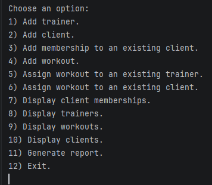

---

### 2. Trainer Management

Trainers can be created by providing their personal information, specialization and employment type.

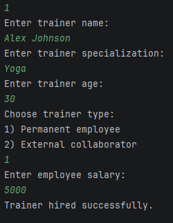

Users can also assign existing workouts to trainers.

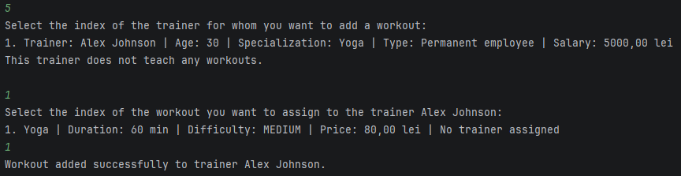

---

### 3. Client Management

New clients can be registered together with their initial membership.

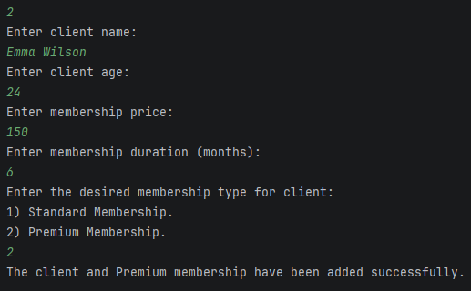

Additional memberships can be assigned to existing clients at any time.

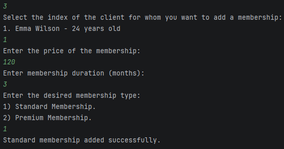

Existing workouts can also be assigned to clients.

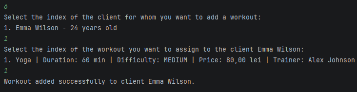

---

### 4. Workout Management

The application allows creating workouts with different intensity levels and prices.

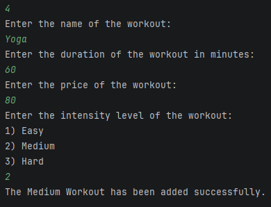

---

### 5. Display Information

Users can browse all registered information, including memberships, trainers, workouts and clients.

#### Client Memberships

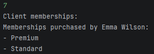

#### Trainers

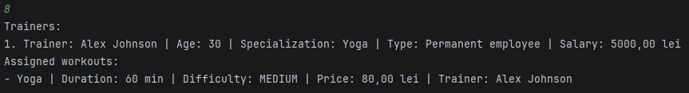

#### Workouts

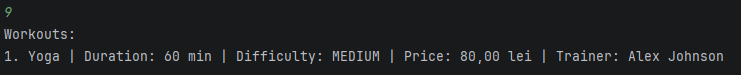

#### Clients

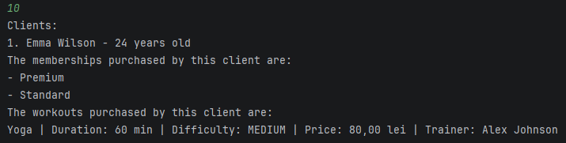

---

### 6. Reports

A summary report displays every workout together with the trainers available to teach it.

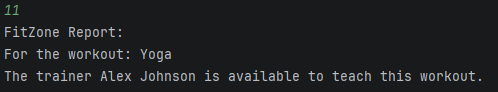

---

### 7. Exit

The application can be safely closed from the main menu.

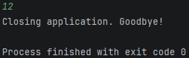

## 🚀 Running

1. Clone the repository.

```bash
git clone <repository-url>
```

2. Open the project in IntelliJ IDEA (or another Java IDE).

3. Build the project using Maven.

```bash
mvn clean package
```

4. Run the `Main.java` class to start the application.

5. Use the interactive console menu to manage trainers, clients, memberships and workouts.

## 📄 License

This project is released under the **MIT License**.
